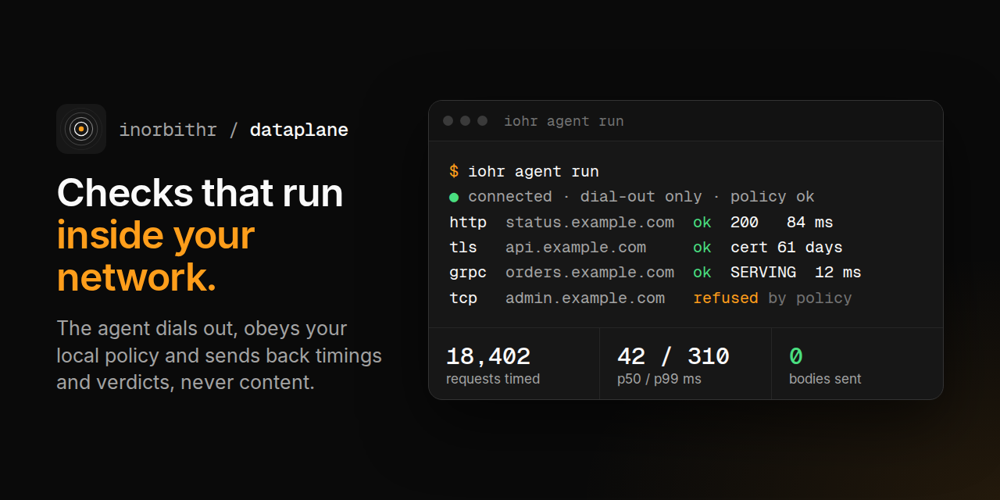

<p align="center"></p>

<p align="center">InOrbit data plane for reliability testing, observability, and experiment execution.</p>

<p align="center">
  <a href="https://github.com/inorbithr/dataplane/actions/workflows/ci.yml"></a>
  <a href="https://github.com/inorbithr/dataplane/actions/workflows/release.yml"></a>
</p>

# InOrbit data plane: the agent

`iohr-agent` runs checks for the InOrbit platform inside your own network, where the
systems are. It dials out to the platform, does only what a local policy file allows, and
sends back timings and verdicts, never content. Design: [RFC 0029](https://inorbit.hr/lab/)
and [ADR 0001](docs/adr/0001-architecture.md).

Status: pre-release (`0.1.0-alpha`). Before 1.0 only the latest release gets fixes
([SUPPORT.md](SUPPORT.md)).

## What it does

- **Dials out only.** One WebSocket to `wss://api.inorbit.hr/v1/agents/session`. Nothing
  listens for the network; there is no inbound firewall rule to ask for. When the
  connection drops, running work stops and nothing new starts until it is back.
- **Has its own identity.** Enrollment exchanges a one-time token for an OAuth2 client
  bound to a key the agent makes on the machine (`private_key_jwt`, RFC 7523). The
  private key never leaves the machine; access tokens last 15 minutes and live in memory.
- **Obeys a local policy that wins.** [`policy.toml`](docs/policy.md) says which networks
  and hosts it may reach, which work it accepts and the ceilings on it. Anything outside
  is refused and the refusal, with its reason, is shown in the console.
- **Keeps credentials where they are.** A check that needs a credential names a
  reference (`vault:kv/staging/app#token`, `k8s:ns/name#key`, `env:NAME`, `file:/path`);
  the agent reads it at the moment of the call and forgets it after.
- **Declares what it watches.** An optional [`checks.toml`](docs/checks.md) lists checks,
  and refusals that must keep happening (`[[refuse]]`); the platform turns them into
  monitors managed by this agent ([RFC 0040.1](https://inorbit.hr/lab/rfc/0040.1-declared-checks-and-self-tests/)).
- **Checks today:** `http` (status, latency, certificate expiry; `GET` to `POST` with a
  small JSON body), `tcp`, `tls`, `grpc_health` (`grpc.health.v1`), and, when the policy
  lists them, the transport surfaces `grpc`, `sse`, `ws`, `mqtt`, `mcp` and `graphql`
  ([checks](docs/checks.md#transport-surfaces)). Load and faults come later and are
  refused until then.

## What it sends to the platform

| Frame | Contents |
|---|---|
| `hello` | agent version, policy hash, capabilities, bound domains, the agent's clock; with a [`checks.toml`](docs/checks.md), the declared checks and their hash; the reported part of [`[metadata]`](docs/config.md#metadata) (site, country, owner team, data classes, trust domain; never rack, secrets backend or runbook) |
| `heartbeat` | a sequence number |
| `result` | job id, `ok`/`failed`/`refused`, start and end time, latency, HTTP status code, error class, certificate expiry, refusal reason |

Never a request or response body, a header value or a secret. A URL path or query leaves
the machine only when you declare it as a target in `checks.toml`. The local admin page
(below) counts every frame sent.

## Install

### As an iohr extension (laptops, pipelines)

```sh
iohr ext install agent          # verifies the signature and provenance, pins the digest
iohr agent init                 # writes agent.toml and policy.toml, checks them with the
                                # platform, creates the enrollment and enrolls
iohr agent run
```

### macOS, as a background service

After the three commands above, with `iohr agent init --dir "$HOME/Library/Application Support/InOrbit"`:

```sh
sh packaging/macos/install.sh          # a LaunchAgent for your user, no sudo
launchctl print gui/$(id -u)/hr.inorbit.agent   # state, runs, last exit code
tail -f ~/Library/Logs/InOrbit/agent.log
sh packaging/macos/install.sh --remove # stop and remove it (keeps config and state)
```

launchd keeps the agent running only while it is enrolled, so an agent that has not
enrolled yet runs once and stops; when the platform revokes it, it stops for good
([plist](packaging/macos/hr.inorbit.agent.plist)). A complete `agent.toml` for a Mac,
with metadata, is [packaging/examples/agent.macos.toml](packaging/examples/agent.macos.toml).

### Kubernetes (Helm)

```sh
kubectl create namespace iohr-agent
kubectl -n iohr-agent create secret generic iohr-agent-enrollment --from-literal=token=ioe_...
helm install agent oci://ghcr.io/inorbithr/charts/iohr-agent --version <version> \
  --namespace iohr-agent \
  --set environment=staging \
  --set enrollment.existingSecret=iohr-agent-enrollment \
  -f my-values.yaml                # policy.policyToml: your networks and hosts
```

The pod runs as non-root with a read-only root filesystem, no capabilities and no
service account token unless you list Secrets for `k8s:` references
(`secrets.kubernetes.secretNames`, a Role with `get` on exactly those names). The key and
enrollment record live on a small volume.

### Debian, Ubuntu, RHEL, Fedora

Download the `.deb` or `.rpm` from the release, then:

```sh
sudo apt install ./iohr-agent_<version>_amd64.deb     # or: sudo dnf install ./iohr-agent-<version>.x86_64.rpm
sudoedit /etc/iohr-agent/agent.toml /etc/iohr-agent/policy.toml   # name, environment, networks
sudo install -m 600 /dev/null /etc/iohr-agent/enrollment.env
echo 'IOHR_AGENT_ENROLLMENT_TOKEN=ioe_...' | sudo tee /etc/iohr-agent/enrollment.env >/dev/null
sudo systemctl enable --now iohr-agent
```

The first start enrolls with the token (single use; delete the file afterwards). The
systemd unit runs as user `iohr-agent` with no privileges and a strict sandbox
([unit](packaging/systemd/iohr-agent.service)).

### From a mirror

Every artifact is an OCI artifact; copy them into your registry with their signatures
(`oras cp -r`, `cosign copy`) and point Helm or `iohr config set ext.registry` at it.

## Operating it

| Command | |
|---|---|
| `iohr-agent init` | write and check `agent.toml` + `policy.toml`; with iohr, create the enrollment and enroll |
| `iohr-agent enroll --token-file f` | make the key and enroll |
| `iohr-agent run` | connect and work until stopped (exit 3: revoked) |
| `iohr-agent status` | running, connected, policy hash, what was sent |
| `iohr-agent policy check [--target URL]` | validate the policy, test a target against it |
| `iohr-agent checks lint [--resolve]` | validate `checks.toml` against the policy, offline; exit 1 on any error |
| `iohr-agent config validate` | check `agent.toml` with `IOHR_AGENT_META_*` overrides applied; every problem names its line; exit 2 on any error |
| `iohr-agent config show` | the effective configuration as TOML, the Vault token reference redacted |
| `iohr-agent config schema` | the JSON Schema of `agent.toml` ([docs/schema/agent.schema.json](docs/schema/agent.schema.json)) |
| `iohr-agent atlas observe --repo DIR --kube-context CTX` | read a checkout and a cluster (through the policy) and write Atlas evidence as JSON lines, locally; nothing is sent ([docs/atlas.md](docs/atlas.md)) |

`agent.toml` is described in [docs/config.md](docs/config.md), including the `[metadata]`
sections (where the agent runs, who owns it, what binds it) that devops fills so the
platform can place its observations; full examples are in [packaging/examples](packaging/examples).

The admin page at `http://127.0.0.1:7790/` (JSON at `/status.json`) is read-only and
answers only on loopback. Telemetry goes to your OpenTelemetry collector when
`[telemetry] enabled = true` in `agent.toml`; nothing is exported by default.

## Traffic capture (preview)

`iohr-capture` is a separate, optional companion that counts the traffic on one interface
with eBPF. It needs three kernel capabilities to start and drops them after attaching, so
the agent above stays unprivileged; it never drops a packet and sends nothing anywhere.
It times requests per route template, and, switched on, keeps whole packets in memory for
pcap files that only root on the host can ask for (`iohr-capture pcap`, deleted after a
retention); `iohr-capture dissect` runs the host's own `tshark` as the person who asks. Requirements, `iohr-capture doctor`, the package, container and
troubleshooting: [docs/capture/install.md](docs/capture/install.md). Design:
[ADR 0002](docs/adr/0002-capture-companion.md). Building and the VM tests:
[docs/capture/develop.md](docs/capture/develop.md).

## Verifying a release

See [docs/security/verifying-releases.md](docs/security/verifying-releases.md): cosign
keyless signatures by this repository's release workflow at a tag, SLSA v1 provenance,
a CycloneDX SBOM per artifact, an OpenVEX statement and CSAF advisories.

## Contributing and security

[CONTRIBUTING.md](CONTRIBUTING.md) · [SECURITY.md](SECURITY.md) (report vulnerabilities
privately) · [GOVERNANCE.md](GOVERNANCE.md) · [Code of conduct](CODE_OF_CONDUCT.md)

Licensed under the [Apache License 2.0](LICENSE).
